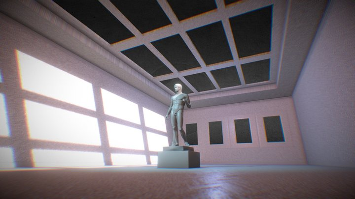
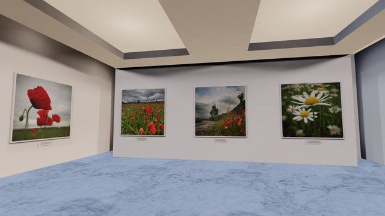
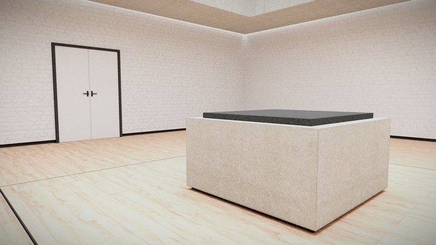
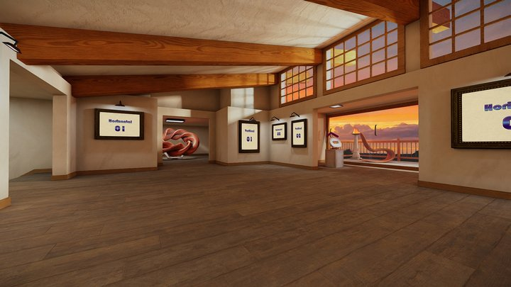

# Metagallery templates

## Attributions

Template rooms 3D models:

- Gallery 1: Esculpture Exhibition

  

  <https://sketchfab.com/3d-models/wip-exhibition-room-cb21a403f6774ef19835295b4a238842> by Loïc Norgeot

- Gallery 2: Landscape Gallery

  

  <https://sketchfab.com/3d-models/landscape-gallery-by-stoneysteiner-3702735762544e5796be4740cb6d5efc> by stoneysteiner

- Gallery 3: Single sculpture

  

  <https://sketchfab.com/3d-models/vr-gallery-1e087aa25dc742e680accb15249bd6be>
  by Elin

- Gallery 4

  In this gallery there is space for 6 vertical and 9 horizontal pictures in 4/3 format

  

  <https://sketchfab.com/3d-models/vr-gallery-house-baked-8e3b280476eb4790af97e2abd3d9be59> by Elin

## Creating your template

- Load the model or scene into Blender
- Remove any unnecessary objects
- Map every frame slots to the data.json using the
  [print_edges.blender.py](./utils/print_edges.blender.py) script.
- Now create the `topview` image by rendering the scene from the top.
  The actual position of SVG view size should be the `max_3dworld_width`
- Create a thumbnail image for the template

## To do

- Template 2

  

  <https://sketchfab.com/3d-models/gallery-showroom-22b427f9480d4e31b9bfe26f19b746e1> by jimbogies

- Template 4

  

  <https://sketchfab.com/3d-models/wip-exhibition-room-f962e5da8fed46508daec928dc740301> by Loïc Norgeot

- Template 6

  

  <https://sketchfab.com/3d-models/vegetable-gallery-a0c6c7a2f4234b5fa45af74743790aff> by Moshe Caine

- Template 8

  

  <https://sketchfab.com/3d-models/vr-gallery-showcase-presentation-building-6dc365ac66884e5aa51f8302c7dc299d> by jimbogies

## Resources

- <https://sketchfab.com/3d-models/david-by-michelangelo-8f4827cf36964a17b90bad11f48298ac> "David by Michelangelo" by jerryfisher
